# 📋 **Semana 8 - Formulario y Registro de Asistencia**

## **Descripción del Proyecto**

**Semana 8** implementa un formulario de registro de asistencia para docentes y alumnos del desfile de San Pedrito, el 26 de junio. Este proyecto incluye componentes de **Material Design**, un **menú emergente (Popup)**, y la integración de un **WebView** para mostrar un sitio web dentro de la aplicación.

**Finalidad del Proyecto:**
- **Formulario de Registro:** Capturar los datos de los usuarios (docentes y alumnos).
- **Material Design:** Incorporar los principios de diseño de Google para una mejor experiencia de usuario.
- **Menú Contextual (Popup):** Implementar un menú emergente para opciones.
- **WebView:** Mostrar un sitio web dentro de la aplicación.

---

## **1. Formulario de Información Personal**

   - **Campos a Ingresar:**
     - Código
     - DNI
     - Apellidos
     - Nombres
     - Correo Institucional
     - Teléfono

   **Vista previa del formulario:**
   

     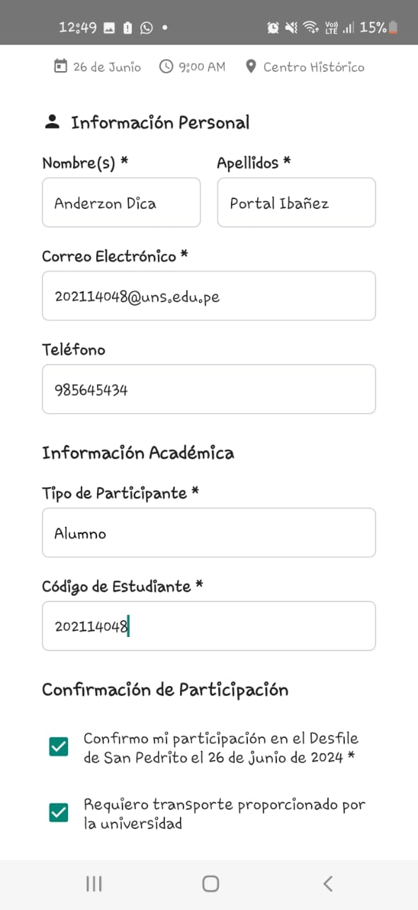
     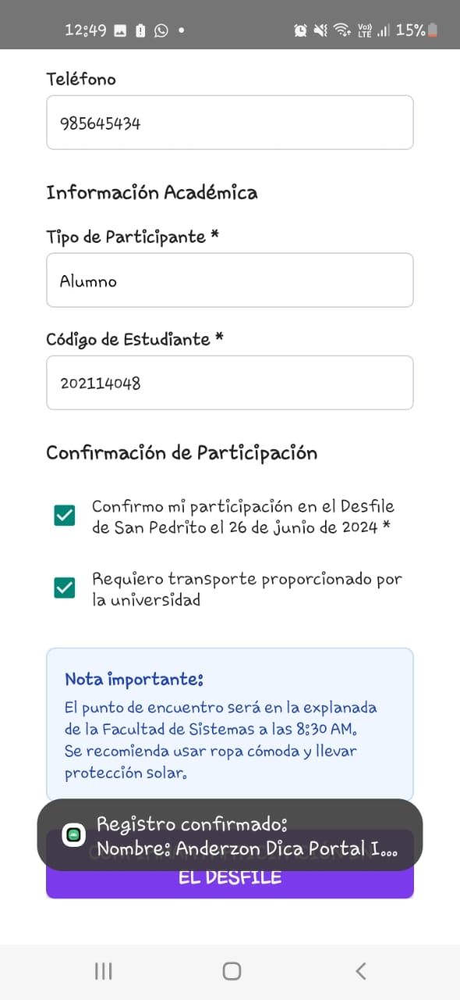
   

---

## **2. Implementación de Material Design**

   - **Características:**
     - Utilización de componentes de **Material Design** para mejorar la interfaz de usuario.

   **Vista previa de Material Design:**
   

     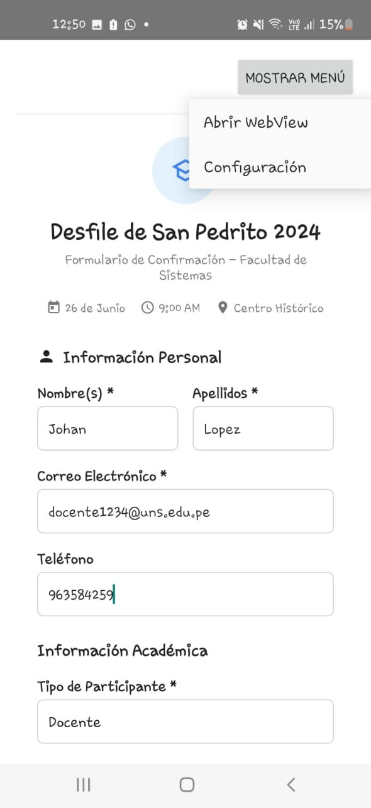
   

---

## **3. Menú Configuración (Popup)**

   - **Objetivo:** Implementar un menú emergente (Popup) para opciones adicionales.

   **Vista previa del menú emergente:**
   

     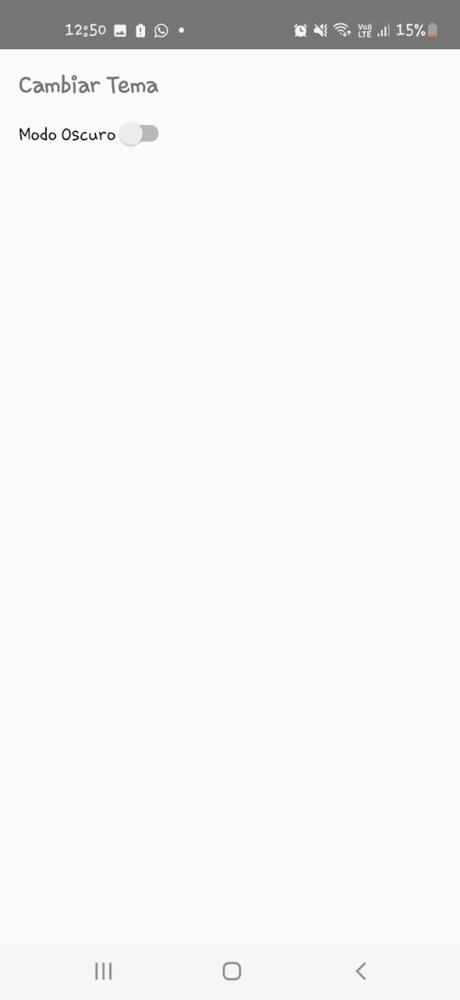
     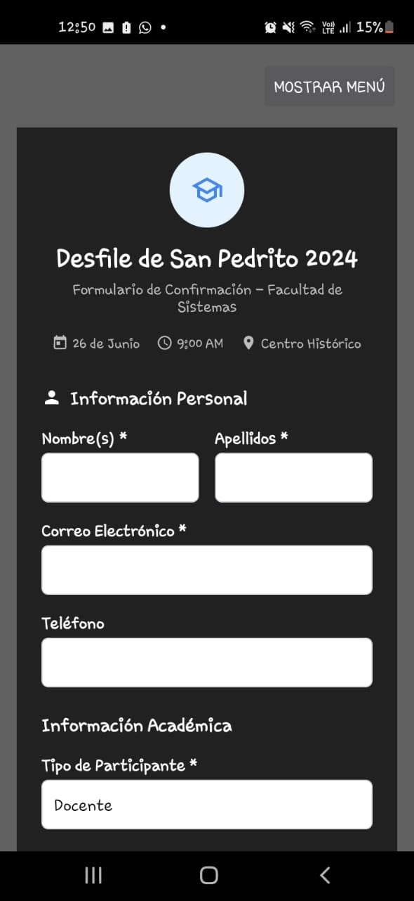
   

---

## **4. WebView - Mostrar Sitio Web**

   - **Objetivo:** Mostrar un sitio web dentro de la aplicación utilizando un **WebView**.

   **Vista previa del WebView:**
   

     
   

---

## **Tecnologías Utilizadas - Semana 8**

- 🧩 Kotlin
- 📱 Android Studio
- 📦 Material Design
- 🌐 WebView
- 🖥️ Menú Emergente (Popup)

---

## **5. Registro de Asistencia**

   - **Objetivo:** Formulario de registro de asistencia para docentes y alumnos del desfile de San Pedrito.

   **Vista previa del formulario de registro:**
   

     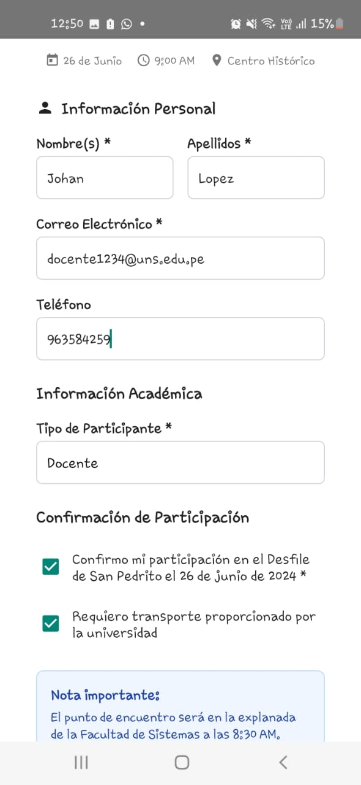
   

---

### **Resumen de imágenes de la Semana 8:**

| Funcionalidad                  | Imagen(s)                                                                 |
|---------------------------------|---------------------------------------------------------------------------|
| 🧑‍💻 Información personal       |  &nbsp;  |
| 🎨 Material Design              |  |
| ⚙️ Menú Configuración (Popup)   |  &nbsp;  |
| 🌐 WebView                     |  |
| 📝 Registro de Asistencia       |  |

---

# 💻 **SharedPreferences - Proyecto Semana 9**

## **Descripción del Proyecto**

**SharedPreferences** es una aplicación móvil que permite gestionar datos de usuario y preferencias a través de almacenamiento local. En este proyecto, se incluyen funcionalidades como la creación de un perfil de usuario, el contador de visitas, y la opción de cambiar entre el modo claro y oscuro para mejorar la experiencia de usuario.

**Finalidad del Proyecto:**
- **Contador de Visitas:** Llevar un registro de las veces que se abre la app.
- **Perfil de Usuario:** Crear un perfil para cada usuario que guarde su nombre, edad y correo electrónico.
- **Modo Oscuro/Claro:** Permitir al usuario alternar entre los dos modos para una mejor interacción visual dependiendo de su preferencia.

---

## **Semana 9:**

### **1. Contador de Visitas**

   - **Objetivo:** Contabilizar cuántas veces se ha abierto la aplicación.
   - **Características:**
     - Un botón para resetear el contador de visitas.

   **Vista previa:**

   

     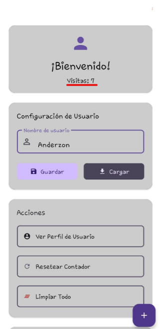
     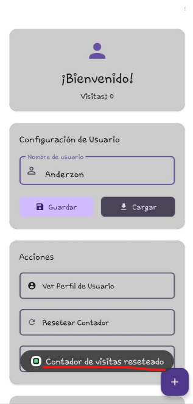
   

---

### **2. Creación de Perfil de Usuario**

   - **Objetivo:** Crear una nueva actividad para que el usuario pueda ingresar su perfil.
   - **Campos a ingresar:**
     - Nombre
     - Edad
     - Email
   - **Acciones:**
     - Botón para guardar y cargar el perfil.
     - Los datos se deben guardar en **SharedPreferences**.

   **Vista previa:**

   

     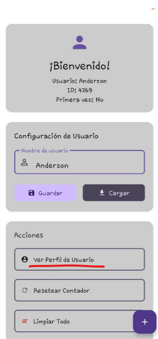
     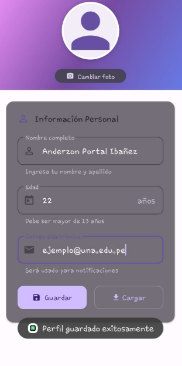
     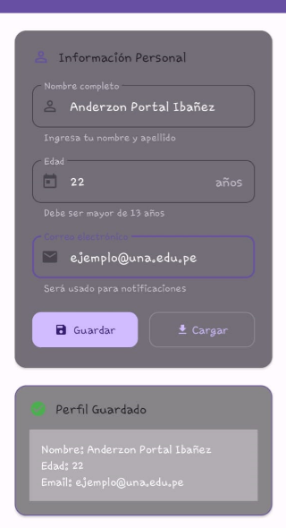
   

---

### **3. Modo Oscuro / Claro**

   - **Objetivo:** Implementar un interruptor (Switch) que permita al usuario cambiar entre el modo claro y el modo oscuro.
   - **Características:**
     - El switch tendrá el texto **"Modo Oscuro"**.
     - Al cambiar el estado del switch, la preferencia se debe guardar inmediatamente y aplicar en tiempo real.
     - **Modo Claro:** Fondo blanco con texto negro.
     - **Modo Oscuro:** Fondo gris con texto blanco.

   **Vista previa:**

   

     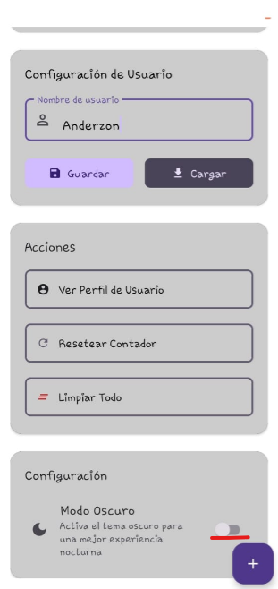
     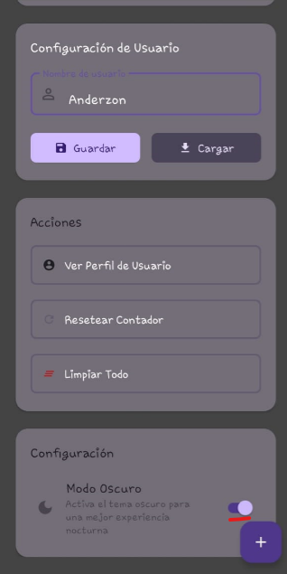
   

---

## **Tecnologías Utilizadas - Semana 9**

- 🧩 Kotlin
- 🔐 SharedPreferences
- 🌙 Modo Oscuro / Claro
- 📱 Android Studio

---

# 🎮 **GameVault - Proyecto Semana 10**

## **Descripción del Proyecto**

**GameVault** es una aplicación móvil diseñada para gestionar tu biblioteca personal de videojuegos. El proyecto incluye integración con Firebase para la autenticación de usuarios y el almacenamiento de datos en tiempo real mediante Firebase Realtime Database. 

**Finalidad del Proyecto:**
- **Configuración Firebase Database:** Configurar Firebase Realtime Database para almacenar información de los juegos.
- **Registro de Juegos:** Crear un formulario para agregar juegos a la biblioteca y guardarlos en Firebase.
- **Lista de Juegos:** Visualizar los juegos registrados con una lista dinámica usando `RecyclerView`.

---

## **Semana 10:**

### **🔥 Configuración Firebase Database**

1. **Habilitar Realtime Database en Firebase Console**  
   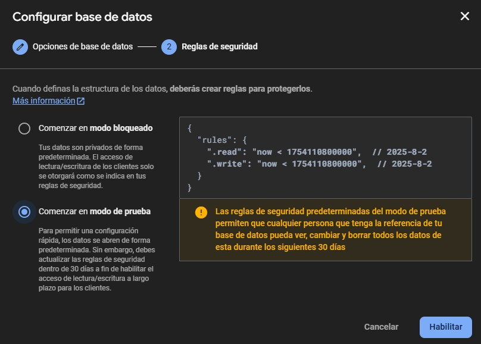

2. **Configurar reglas de seguridad**  
   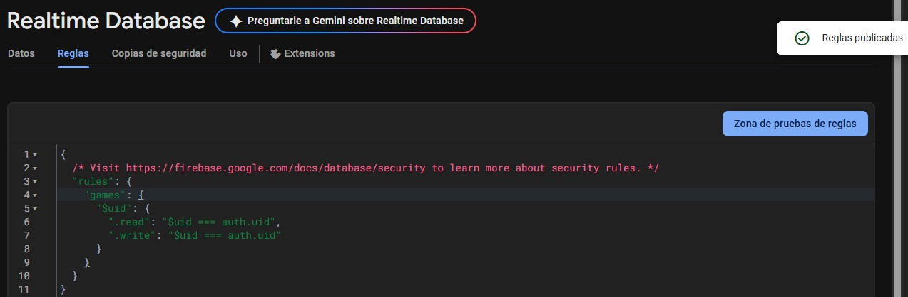

3. **Agregar dependencia en `build.gradle`**  
   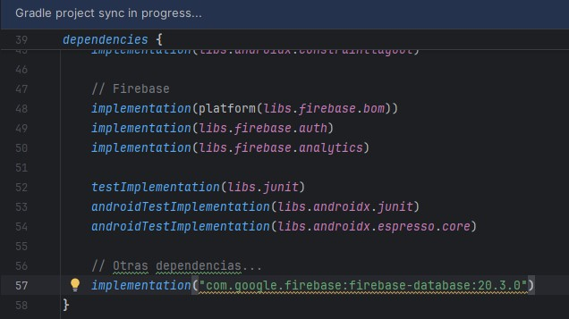

---

### **💾 Registro de Juegos**

Todo comienza con un formulario intuitivo para agregar juegos a tu biblioteca personal.

- 🧩 **Crear modelo `Game.kt`**  
  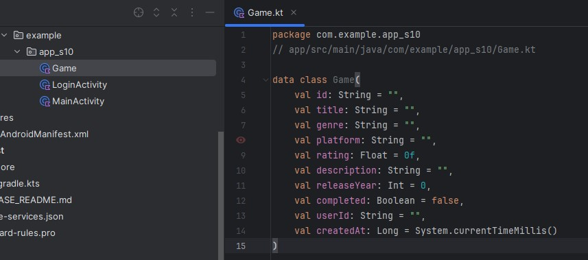

- 🛠️ **Implementar `AddGameActivity.kt`**  
  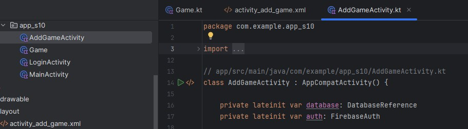

- ✅ **Crear formulario con validaciones**  
  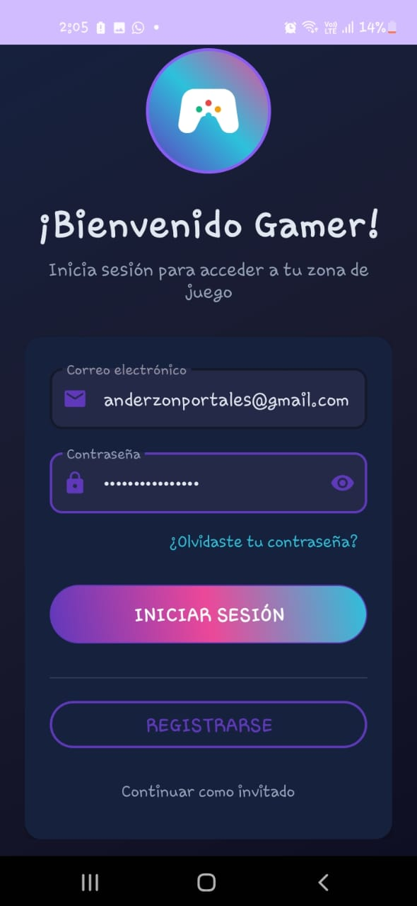

---

### **📋 Lista de Juegos**

Visualiza tus juegos registrados en una lista dinámica con datos en tiempo real.

- 🧱 **RecyclerView con `GameAdapter`**  
  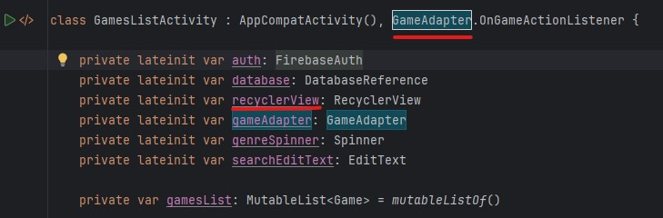

- 🙋‍♂️ **Mostrar datos del usuario autenticado**  
  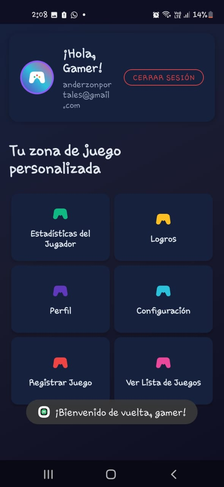

| Funcionalidad              | Imagen                                                                 |
|---------------------------|------------------------------------------------------------------------|
| ✏️ Editar juegos           | 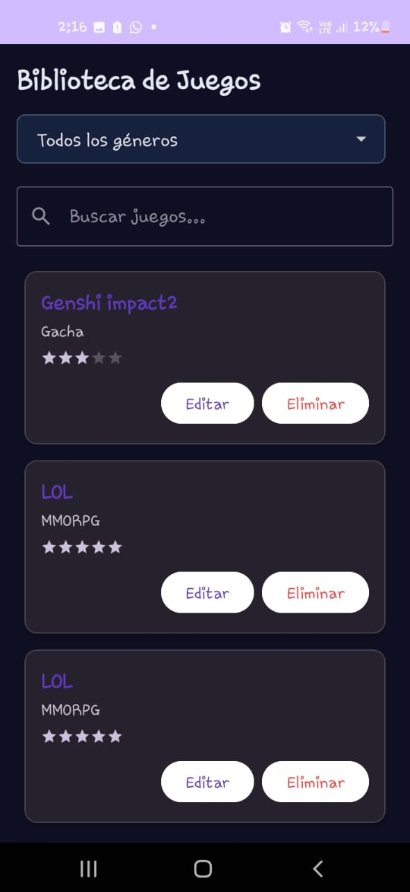 &nbsp; 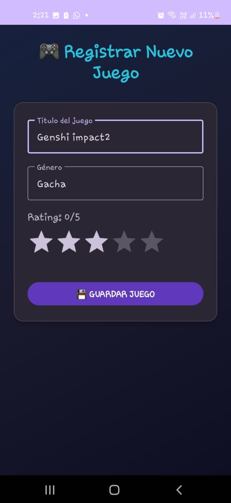 &nbsp; 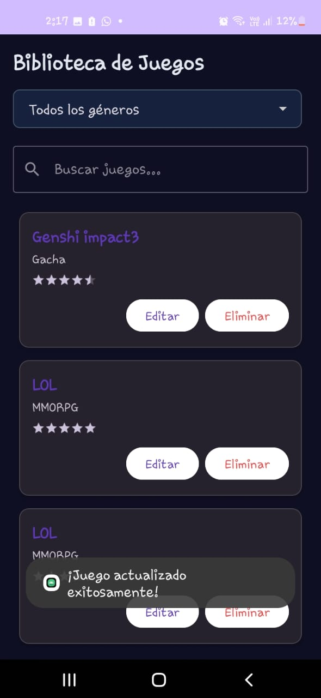 |
| 🗑️ Eliminar juegos         | 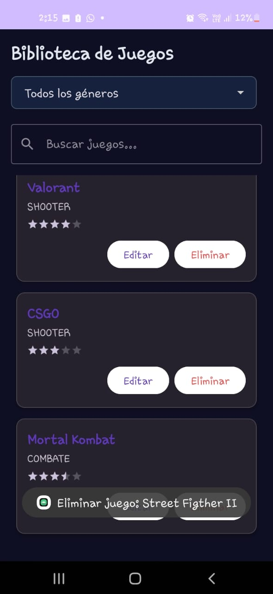 &nbsp;&nbsp; 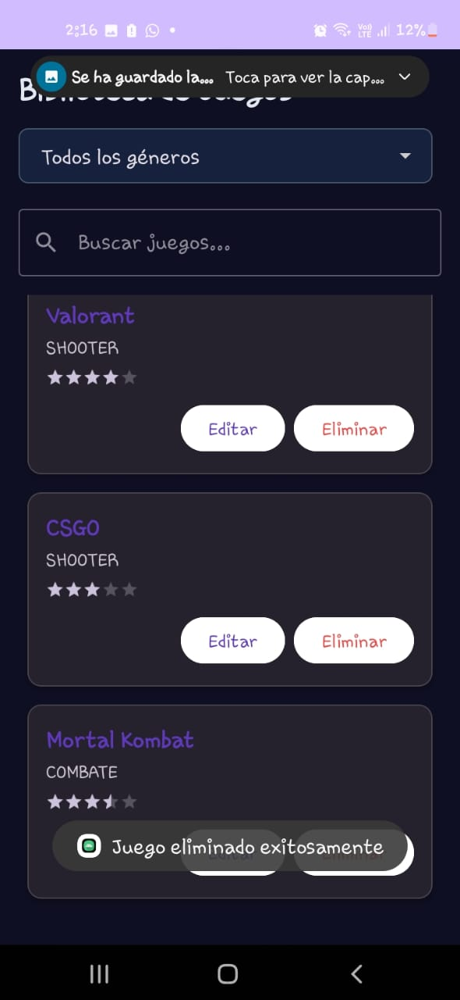 |
| 🎯 Filtro por género       | 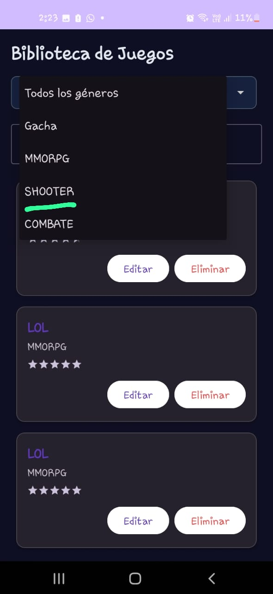 &nbsp;&nbsp; 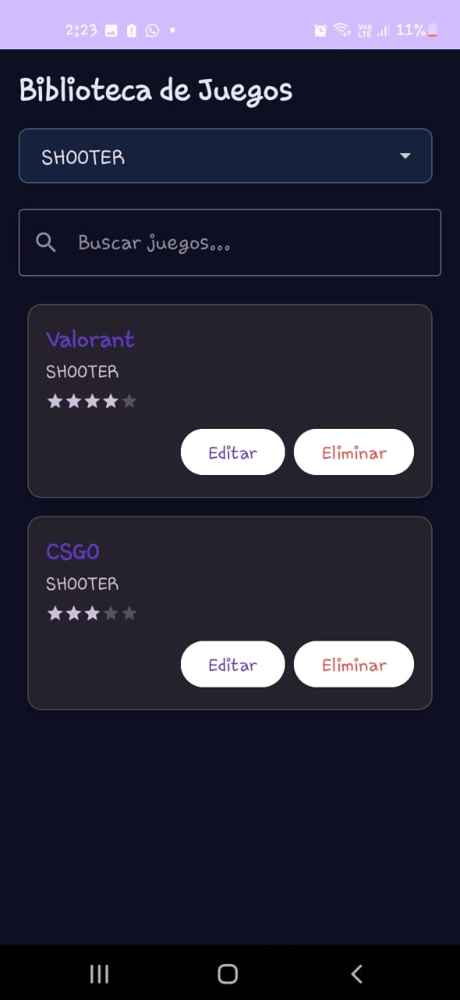 |
| 🔍 Búsqueda por título     | 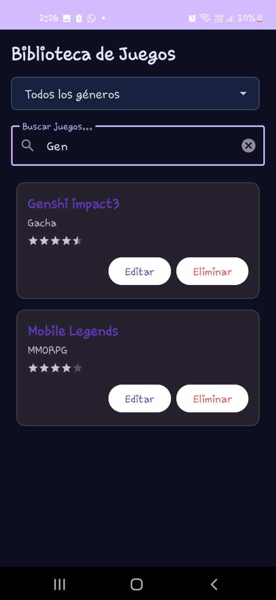 |

---

## **Tecnologías Utilizadas - Semana 10**

- 🧩 Kotlin
- 🔐 Firebase Authentication
- 🌐 Firebase Realtime Database
- 📱 Android Studio
- 📦 RecyclerView

---
